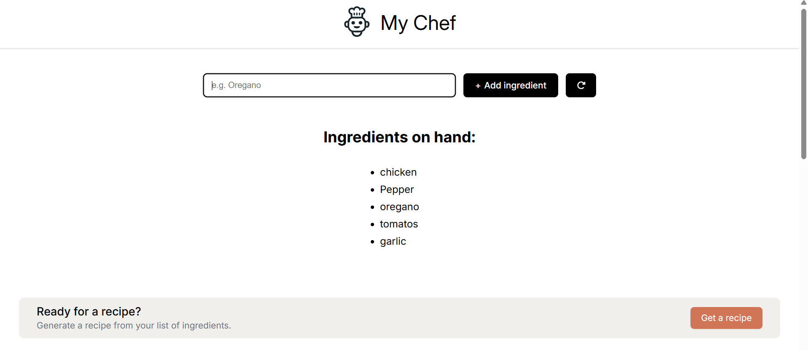

👨‍🍳 My Chef
My Chef is an AI-powered recipe suggestion app built with React.js. Enter the ingredients you have, click "Get Recipe", and let your personal chef (powered by Mistral AI) whip up a dish with step-by-step instructions.

🍽️ Features
Input multiple ingredients

AI-generated recipes and instructions

Fast, clean UI with modern styling

Responsive design for all devices

🛠️ Tech Stack
React.js – Component-based architecture

HTML + CSS – Layout and custom styling

Mistral AI API – Recipe generation

.env – Secure API key handling

🚀 Live Demo
https://my-chef-web.netlify.app/

📸 Screenshots
